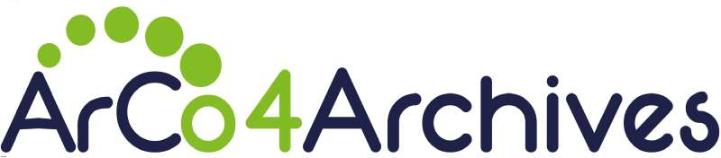

**Scegli la lingua / Choose your language**

[](README.md)
[](README.en.md)

# Risorse semantiche per il progetto *ArCo4Archives*

[](https://icar.cultura.gov.it/standard/standard-san/arco4archives)

## Introduzione

Questo repository ospita l'**ontologia**, i **vocabolari controllati**, gli **allineamenti semantici esterni** che costituiscono gli asset semantici progettati e sviluppati nell'ambito dell'iniziativa per la realizzazione di una rete di ontologie **Arco4Archives**: [Standard archivistici ICAR: Arco4Archives](https://icar.cultura.gov.it/standard/standard-san/arco4archives).

L'ICAR si è posto l’obiettivo di arricchire gli strumenti di interoperabilità attraverso lo sviluppo di una rete di ontologie (ArCo4Archives) per rappresentare il dominio archivistico, che estenda le ontologie di **ArCo - Architettura della conoscenza**, sviluppate dall'ICCD e dal CNR con l'Università di Bologna e che serva come modello di riferimento per la produzione e pubblicazione del **grafo della conoscenza** (knowledge graph) degli archivi basato sui dati del [SIA (Sistema Informativo Archivistico)](https://icar.cultura.gov.it/sistemi-e-portali/archivi-nazionali/sia).

Il modello di riferimento su cui sono state sviluppate le ontologie ArCo4Archives è lo standard di interoperabilità di descrizione archivistica ICAR Import2. 
Il progetto si prefissa l'obiettivo di creare una modellazione ontologica per produrre dati strutturati in un **grafo della conoscenza** semantico, secondo il paradigma dei Linked Open Data.

### Il Progetto

[Arco4Archives](https://portalefontirepubblicaitaliana.cnr.it/) è un progetto coordinato dall' **ICAR** e prodotto da [**BUP srl**](https://www.bupsolutions.com/) e **Istituto di Scienze e Technologie della Cognizione del CNR** - **[ISTC-CNR](https://www.istc.cnr.it/)**, finalizzato alla realizzazione di un'infrastruttura semantica interoperabile basata su standard aperti per la modellazione delle informazioni catalogate all'interno del sistema SIA. Partendo dai requisiti dei tracciati ICAR Import2 e dal modello dati del sistema, è stato possibile modellare la rappresentazione delle risorse archivistiche e delle loro relazioni gerarchiche e di contenimento, la rappresentazione dei contenuti, del loro ordinamento e delle interconnesioni con persone, organizzazioni, istituzioni e il loro sviluppo nel tempo. 

## Struttura del repository

Questo repository è organizzato per supportare l'intero ciclo di vita delle ontologie, dalla progettazione alla pubblicazione e manutenzione. I moduli ontologici seguono un approccio modulare e un sistema di versionamento esplicito, finalizzati a garantire la retrocompatibilità e la stabilità degli URI degli elementi che compongono la rete di ontologie.

```text
assets/
└── controlled-vocabularies/     # Riferimento per i vocabolari controllati
    ├── [vocabulary-name]/       # Singoli vocabolari 
    │   └── vocab.ttl            # Distribuzioni del vocabolario
└── ontologies/                  # Riferimento per le ontologie definite in OWL
    ├── [module-name]/           # Modulo 'archival-resource'
    │   ├── v0.1/                # Snapshot con specifica versione
    │   ├── ...
    │   ├── latest/              # Copia dell'ultima versione stabile
    │   │   ├── module.owl       # Serializzazione OWL RDF/XML 
    │   │   ├── module.rdf       # Serializzazione RDF/XML
    │   │   └── module.ttl       # Serializzazione Turtle
    │   └── ontology-diagrams/             
    │       ├── module.graphml   # Sorgente del diagramma Graffoo
	│       ├── module.jpeg      # Diagramma Graffoo
	│       ├── ...
	│       ├── module.jpeg      # Diagramma Graffoo
	│       ├── ...
    └── ...
    └── ...
```

📂 [`ontologies/`](./ontologies)

Costituisce il nucleo del repository e contiene il **modulo ontologico** prodotto. Il modulo è organizzato per versioni. La directory `latest/` contiene sempre la versione stabile più recente dell'ontologia, resa disponibile in diverse serializzazioni RDF (ad esempio Turtle e RDF/XML).

Per ciascun modulo sono inoltre fornite rappresentazioni grafiche realizzate come diagrammi [Graffoo](https://essepuntato.it/graffoo/). Tali diagrammi descrivono formalmente classi, proprietà e assiomi delle ontologie, e costituiscono il principale riferimento visuale per la comprensione della struttura concettuale dei modelli.

## La rete di ontologie

La rete ontologica del portale è progettata come un insieme modulare di ontologie interconnesse, in grado di garantire una chiara separazione dei domini rappresentati, pur mantenendo una visione unificata dei diversi ambiti di conoscenza e dei relativi dati di dominio. L'architettura semantica adotta un approccio multilivello, che bilancia la modellazione di specifica conoscenza di dominio con l'interoperabilità tra domini diversi e il riuso di ontologie esistenti.

### Archival resource ontology - ArCo4Archives

**URI**: [`https://w3id.org/arco/archives/ontology/archival-resource`](https://w3id.org/arco/archives/ontology/archival-resource)


La *Archival Resource Ontology* (a-arc) 
è il modulo di ArCo per la rappresentazione del dominio archivistico. Amplia ed estende la [rete ontologica ArCo](https://github.com/ICCD-MiBACT/ArCo). 

#### Le risorse archivistiche 
Partendo dalla struttura semantica del dominio dei beni culturali, il modulo estende e specializza diverse modellazioni nazionali per accogliere la specificità del dominio archivistico. La superclasse `a-arc:ArchivalResource` rappresenta una generica risorsa specializzabile nelle tre classi fondamentali del dominio: `a-arc:ArchivalResourceSet`, il complesso archivistico, `a-arc:ArchivalUnit`, l'unità archivistica e `a-arc:ArchivalItem`, l'unità documentaria.

#### La responsabilità
In termini di estensione, la `a-cd:Responsibility` di ArCo, che rappresenta la responsabilità di un'agente sulla realizzazione di un bene, si estende con l'`a-arc:ArchivalResponsibility` che presuppone i due fondativi ruoli nel contesto archivistico: `a-arc:ArchivalCreator` e `a-arc:ArchivalHolder`. 

#### Gli agenti


Gli agenti sono specializzati in persone, famiglie e organizzazioni. Una modellazione specializzata viene applicata per le `a-arc:FormalOrganization`, con lo sforzo di rappresentazione dei profili istituzionali `a-arc:InstitutionalProlie`, tipizzati anche nel tempo, e il contesto storico-istutuzionale di provenienza `a-arc:HistoricalOrInstitutionalContext`.


Le `a-arc:NaturalPerson` con i loro attributi nel tempo (professioni, qualifiche e titoli nobiliari), vengono rappresentate seguendo l'ontologia nazionale CPV di OntoPiA, riutilizzando ArCo per i blocchi semantici già catturati dal dominio culturale e specializzando entità per accogliere le verticalità del dominio.

### Vocabolari controllati 
A supporto dell'impalcatura ontologica, vengono prodotti e definiti vocabolari controllati che definiscono i concetti classificatori del dominio. I vocabolari controllati sono formalizzati in LOD secondo lo standard [**Simple Knowledge Organization System (SKOS)**](https://www.w3.org/TR/skos-reference/).

## Namespace e URI di base

Per garantire persistenza, stabilità e risoluzione a lungo termine degli URI, il progetto utilizza l'infrastruttura [w3id](https://w3id.org/), mantenendo il seguente URI di base:

* `https://w3id.org/arco/archives/`

Questo URI di base è ulteriormente articolato in *namespace* dedicati alle ontologie e alle risorse semantiche, come i vocabolari controllati:

* Ontologie: `httphttps://w3id.org/arco/archives/ontology/`
* Vocabolari controllati: `httphttps://w3id.org/arco/archives/controlled-vocabulary/`

## Licenza


I moduli ontologici e la relativa documentazione sono rilasciati sotto licenza [Creative Commons Attribution 4.0 International (CC BY 4.0)](https://creativecommons.org/licenses/by/4.0/).
